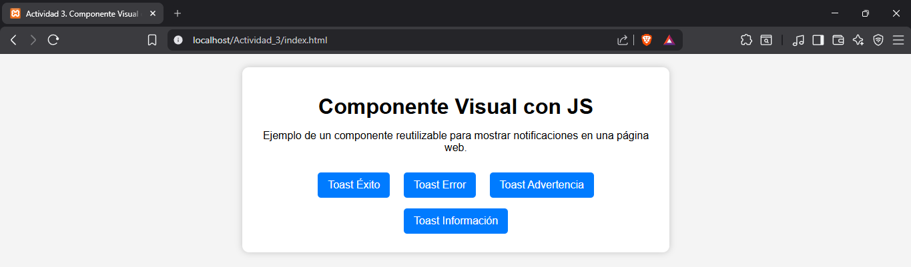
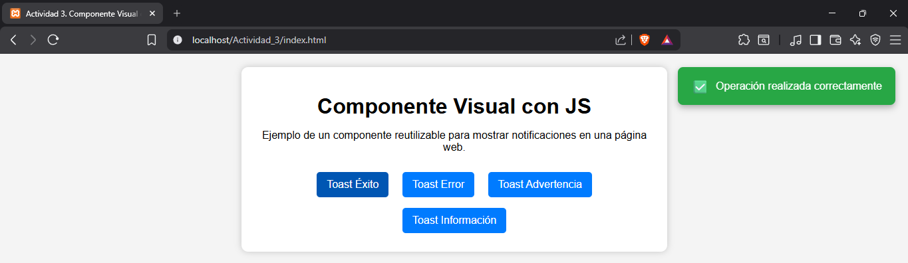
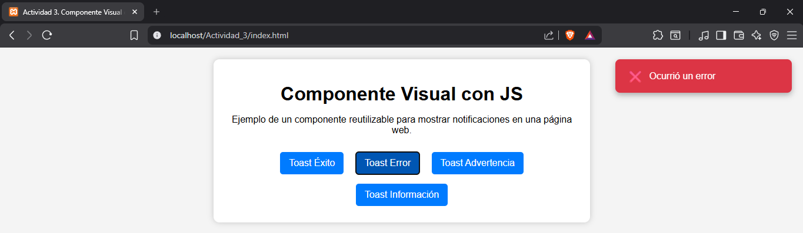
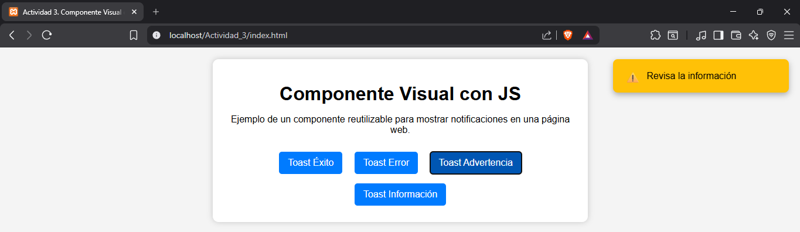
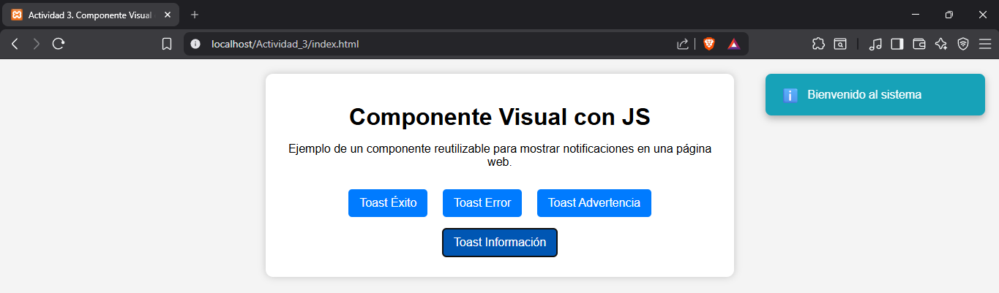
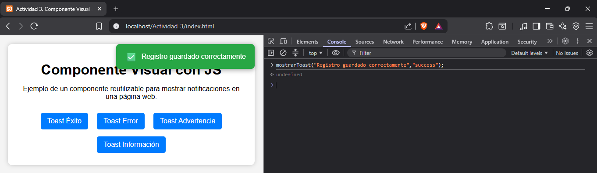

# Instituto Tecnológico de Oaxaca

# Actividad 3 - Componente Visual con JavaScript

# Componente Toast

## Docente
**Martinez Nieto Adelina**

## Alumno
**Hernández Ruiz Jonatan Gadiel**

## Materia
**Programación Web**

## Descripción

Este proyecto consiste en una librería JavaScript que implementa un componente visual tipo Toast, utilizado para mostrar notificaciones temporales al usuario. El componente es reutilizable, admite diferentes tipos de mensajes (éxito, error, advertencia e información) y permite mostrar varias notificaciones de forma simultánea sin reemplazar las anteriores, evitando el uso de alertas tradicionales y mejorando la experiencia del usuario.

---

# Instalación

Agrega el archivo CSS y el archivo JavaScript a tu proyecto.

```html
<link rel="stylesheet" href="css/componente.css">
<script src="js/componente.js"></script>
```

---

# Uso

Mostrar un mensaje de éxito:

```javascript
mostrarToast("Registro guardado correctamente","success");
```

Mostrar un mensaje de error:

```javascript
mostrarToast("Ocurrió un error","error");
```

Mostrar una advertencia:

```javascript
mostrarToast("Revisa la información","warning");
```

Mostrar un mensaje informativo:

```javascript
mostrarToast("Bienvenido al sistema","info");
```

**Nota:** El componente permite mostrar varias notificaciones al mismo tiempo, las cuales se apilan automáticamente y desaparecen de forma independiente.

---

# Capturas de pantalla

## Página principal



---

## Toast de éxito



---

## Toast de error



---

## Toast de advertencia



---

## Toast de información



---

## Varios Toast simultáneos


---

## Consola



---

# Video demostrativo

▶ **Video:**

https://drive.google.com/file/d/1I5vDjLF7MIvhiel-aIB_A-Bm0kc6UfPN/view?usp=sharing

---

# Tecnologías utilizadas

- HTML5
- CSS3
- JavaScript